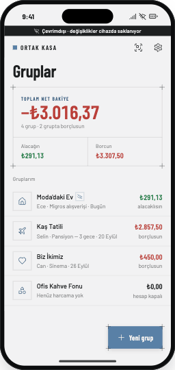
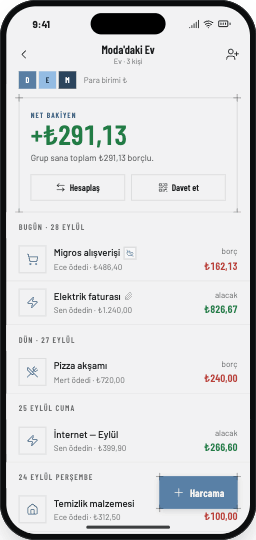
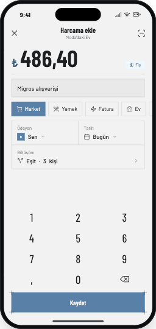
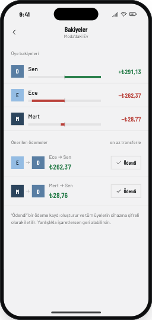
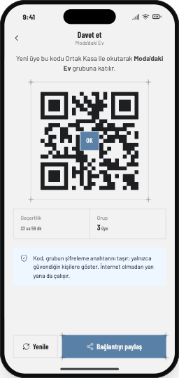
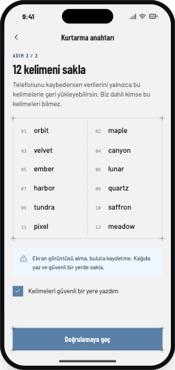
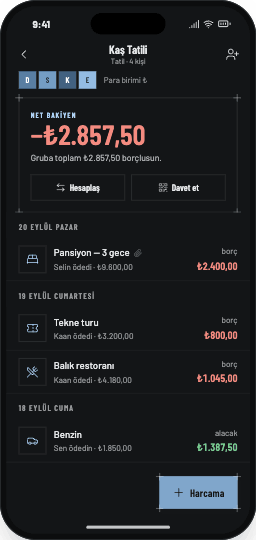
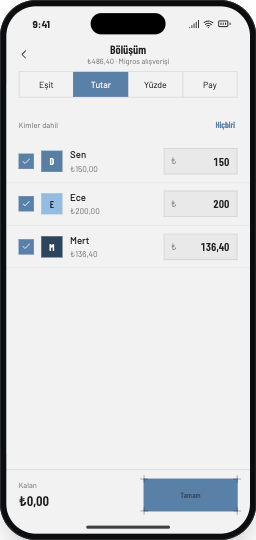
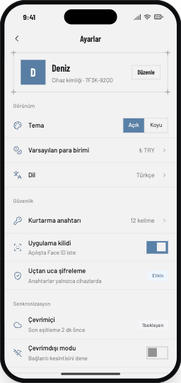
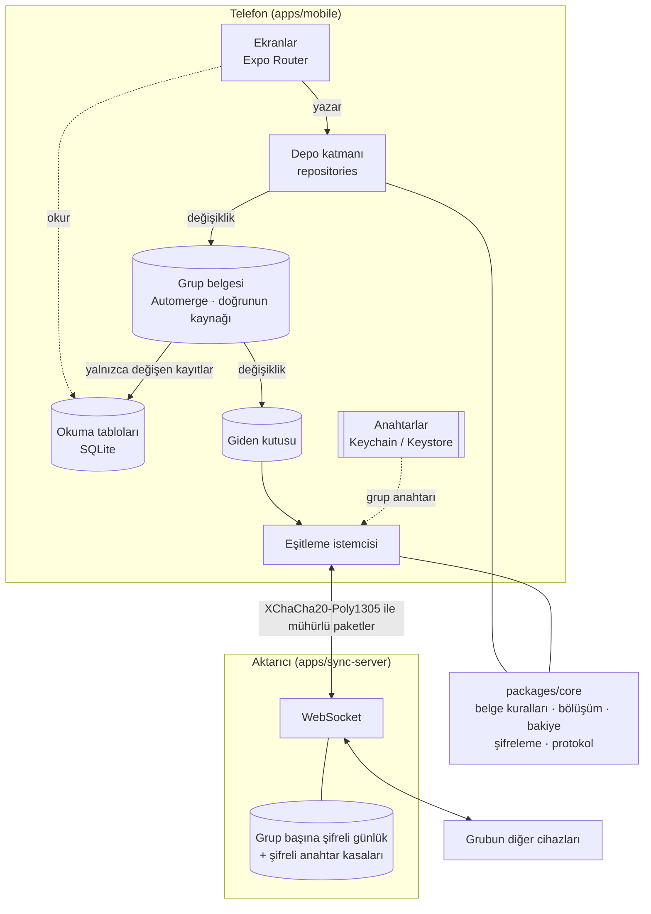

# Ortak Kasa

Ev arkadaşları, tatil grupları ve çiftler için ortak harcama takibi. Kim ne ödedi, kim kime ne
kadar borçlu ve hesabı en az kaç ödemeyle kapatırsınız.

Üç şeyi farklı yapar:

- **İnternet yokken de çalışır.** Veri önce cihaza yazılır; bağlantı geldiğinde grubun diğer
  cihazlarıyla kendiliğinden eşitlenir.
- **Uçtan uca şifrelidir.** Sunucu yalnızca açamadığı şifreli paketleri taşır. Hesap, e-posta ya
  da telefon numarası yoktur.
- **Çakışmayı saklamaz.** İki kişi aynı harcamayı aynı anda değiştirirse uygulama birini
  sessizce ezmek yerine iki sürümü gösterip sorar.

## Durum

| Özellik                                                                                            | Durum                                                                                                         |
| -------------------------------------------------------------------------------------------------- | ------------------------------------------------------------------------------------------------------------- |
| Gruplar, üyeler, harcamalar (eşit / tutar / yüzde / pay)                                           | Hazır                                                                                                         |
| Bakiyeler ve en az transferle hesaplaşma önerisi                                                   | Hazır                                                                                                         |
| Etkinlik geçmişi, istatistikler, CSV dışa aktarma                                                  | Hazır                                                                                                         |
| Cihazlar arası eşitleme ve çakışma çözümü                                                          | Hazır                                                                                                         |
| Uçtan uca şifreleme, kurtarma ifadesi, QR ile davet                                                | Hazır (bağımsız denetimden geçmedi)                                                                           |
| Üye çıkarınca anahtar yenileme, Face ID / parmak izi kilidi                                        | Hazır                                                                                                         |
| Fiş fotoğrafı ekleme, gruba uçtan uca şifreli eşitleme                                             | Hazır                                                                                                         |
| Fiş okuma: kamera, cihaz üstü metin tanıma (iOS Apple Vision, Android ML Kit), formun doldurulması | Yazıldı; tanıma ve ayrıştırma macOS'ta gerçek görsellerle doğrulandı, **telefonda denenmedi** (aşağıya bakın) |
| Türkçe ve İngilizce arayüz, açık ve koyu tema                                                      | Hazır                                                                                                         |

## Ekran görüntüleri

Görseller tasarım dosyalarından alınmıştır; cihazdan çekilmiş ekran görüntüleri değildir.

| Gruplar                             | Grup detayı                                | Harcama ekle                                  |
| ----------------------------------- | ------------------------------------------ | --------------------------------------------- |
|  |  |  |

| Bakiyeler ve hesaplaşma                 | Davet (QR)                         | Kurtarma ifadesi                              |
| --------------------------------------- | ---------------------------------- | --------------------------------------------- |
|  |  |  |

| Koyu tema                                     | Bölüşüm ayarı                       | Ayarlar                             |
| --------------------------------------------- | ----------------------------------- | ----------------------------------- |
|  |  |  |

## Mimari

Depo bir npm çalışma alanıdır:

| Paket              | Ne                                                                                                                                                                           |
| ------------------ | ---------------------------------------------------------------------------------------------------------------------------------------------------------------------------- |
| `apps/mobile`      | Expo (React Native) uygulaması: ekranlar, yerel veritabanı, eşitleme istemcisinin cihaz tarafı; `modules/receipt-ocr` altında Swift ve Kotlin ile yazılmış fiş tanıma modülü |
| `apps/sync-server` | Aktarıcı sunucu: WebSocket üzerinden şifreli değişiklikleri saklar ve iletir                                                                                                 |
| `packages/core`    | Saf iş mantığı: grup belgesi, bölüşüm, bakiye, borç sadeleştirme, şifreleme, eşitleme protokolü, fiş ayrıştırıcı. Arayüz ve depolama bilmez; hem cihazda hem Node'da çalışır |



Bir harcama eklendiğinde:

1. Ekran, depo katmanındaki `createExpense`'i çağırır.
2. `packages/core` kuralları uygular (paylar tutara eşit mi, üyeler grupta mı) ve grubun Automerge
   belgesinde bir değişiklik üretir.
3. Tek bir veritabanı işleminde değişiklik saklanır, giden kutusuna konur ve yalnızca dokunduğu
   kayıtlar SQLite'taki okuma tablolarına yansıtılır. Ekranlar bu tablolardan okur.
4. Bağlantı varsa istemci değişikliği grup anahtarıyla mühürleyip aktarıcıya gönderir; aktarıcı
   onu günlüğe ekler ve grubun diğer cihazlarına iletir. Harcamanın fiş fotoğrafı varsa o da aynı
   anahtarla mühürlenip ayrı bir dosya olarak gönderilir; diğer cihazlar fotoğrafı ancak
   harcamayı açtıklarında indirir.
5. Diğer cihazlar paketi açar, belgelerine uygular (sıra ve yineleme fark etmez) ve kendi
   tablolarını günceller.

## Teknik kararlar

| Karar                                           | Neden                                                                                                                                    | Bedeli                                                                                                       |
| ----------------------------------------------- | ---------------------------------------------------------------------------------------------------------------------------------------- | ------------------------------------------------------------------------------------------------------------ |
| **Local-first**                                 | Harcama, bağlantının kötü olduğu yerde girilir; veri kişiseldir. Okuma ve yazma hiçbir zaman ağ beklemez.                                | Kuralları sunucu zorlayamaz; yedek kullanıcının sorumluluğundadır.                                           |
| **CRDT, Automerge**                             | Sunucu veriyi göremediği için birleştirmeyi cihazlar yapmak zorunda. CRDT, değişiklikler hangi sırayla gelirse gelsin aynı sonucu verir. | Belge yalnızca büyür; çok büyük gruplarda yüklemesi yavaş. Cihazda WebAssembly yorumlayıcı üzerinde çalışır. |
| **Harcama bütün olarak yazılır**                | Tutar ve paylar tutarlı kalmalı; alan alan birleştirme toplamı bozabilirdi. Eşzamanlı düzenleme açık bir çakışmaya dönüşür.              | Kullanıcı ara sıra bir çakışma sorusuyla karşılaşır.                                                         |
| **Grup anahtarıyla uçtan uca şifreleme**        | Sunucu ve işleteni içerik görmemeli. Davet bir QR, kurtarma 12 kelime.                                                                   | Üst veri görünür; değişiklikler imzalı değil; ifadeyi kaybeden veriyi kaybeder.                              |
| **SQLite okuma tabloları, artımlı projeksiyon** | Ekranların ihtiyacı sorgudur; belgeyi her seferinde çözmek pahalı.                                                                       | İki kopya vardır; eşdeğerlikleri testle güvenceye alınır.                                                    |
| **Tutarlar kuruş cinsinden tam sayı**           | Kayan nokta hatası olmaz; artan kuruşlar her cihazda aynı üyeye düşer.                                                                   | Para birimi başına ölçek sabittir (2 hane).                                                                  |
| **Fiş okuma için kendi yerel modülümüz**        | Hazır eklentiler iOS'ta da Google ML Kit kullanıyor ve kâğıdın kenarını bulmuyor. Apple Vision sistemle gelir, ek bağımlılık getirmez.   | Bakımı bizde; iki platformda iki ayrı gerçekleme.                                                            |
| **İş mantığı ayrı pakette, saf fonksiyonlarla** | Cihaz olmadan, Node'da hızlıca sınanır; sunucu ve uygulama aynı protokol kodunu kullanır.                                                | Paketler arası sınırı korumak disiplin ister.                                                                |

## Kurulum

Gerekenler: Node 22, npm 10 ya da üstü; iOS için Xcode, Android için Android Studio.

```sh
git clone https://github.com/zeynepbass/shared.safe.git
cd shared.safe
npm ci
```

> Depoyu iCloud Drive, Dropbox gibi eşitlenen bir klasörde tutmayın. Eşitleme servisi
> `node_modules` ve `.git` içindeki dosyaları yerelden boşalttığında test, lint ve git komutları
> hata vermeden takılır.

### Aktarıcı sunucu

```sh
npm run server            # ws://localhost:8787, veriler sync-server.db dosyasında
```

`PORT` ve `SYNC_DB` ortam değişkenleriyle değiştirilebilir. Sunucu olmadan da uygulama çalışır;
yalnızca cihazlar arası eşitleme ve yeni cihaza geri yükleme olmaz.

### Uygulama

Uygulama yerel modüller içerir (libsodium, VisionCamera), bu yüzden Expo Go ile çalışmaz; bir
geliştirme yapısı gerekir:

```sh
cd apps/mobile
cp .env.example .env      # isteğe bağlı: aktarıcı adresi, Sentry DSN
npx expo run:ios          # ya da: npx expo run:android
```

İlk yapıdan sonra `npm run mobile` (depo kökünden) Metro'yu başlatır. Gerçek bir telefon,
bilgisayardaki aktarıcıya `EXPO_PUBLIC_SYNC_URL=ws://<bilgisayarın-IP'si>:8787` ile ulaşır.

## Komutlar

Depo kökünden:

| Komut            | Ne yapar                                           |
| ---------------- | -------------------------------------------------- |
| `npm test`       | Üç paketin birim testleri (Jest ve Vitest)         |
| `npm run lint`   | ESLint                                             |
| `npm run format` | Prettier                                           |
| `npm run bench`  | 10.000 harcamalı grupla performans ölçümü          |
| `npm run e2e`    | Maestro akışları (kurulu bir yayın yapısı gerekir) |
| `npm run mobile` | Metro                                              |
| `npm run server` | Aktarıcı sunucu                                    |

Veritabanı şeması değiştiğinde `apps/mobile` içinde `npm run db:generate` yeni göçü üretir.

## Kalite

- **Testler.** `packages/core` kuralları, birleştirmeyi ve şifrelemeyi; `apps/mobile` depo
  katmanını gerçek göçlerle ve birden fazla "telefon" ile; `apps/sync-server` aktarıcıyı gerçek
  WebSocket bağlantılarıyla sınar. Arayüz bileşenlerinin birim testi yoktur; arayüz Maestro
  akışlarıyla sınanır.
- **Performans.** 10.000 harcamalı grupla ölçüm betiği: `npm run bench`.
- **Erişilebilirlik.** Kullanılan her metin ve zemin rengi çifti için kontrast oranı testle
  denetlenir.
- **Sürekli tümleştirme.** Her pull request'te lint ve birim testleri çalışır
  (`.github/workflows/ci.yml`).

## Bilinen sınırlar

- **Fiş okuma telefonda denenmedi.** Tanıyıcının Swift kodu macOS'ta derlenip düz ve eğik fiş
  görsellerinde çalıştırıldı, ayrıştırıcı bu gerçek çıktılarla sınandı. Ama uygulamanın
  kendisi bu depoda bir cihazda ya da simülatörde derlenip çalıştırılmadı: kamera ekranı, canlı
  kenar algılama ve Android (Kotlin, ML Kit) tarafı hiç çalıştırılmadı. Test görselleri de
  üretilmiş, temiz görsellerdir; buruşuk, soluk ya da gölgeli gerçek fişlerde doğruluk daha
  düşük olacaktır.
- Android'de fişin "kenarları" kâğıdın gerçek kenarı değil, bulunan metnin çevresidir.
- Bir fiş fotoğrafı en fazla 640 KB olarak eşitlenir; aktarıcıdaki dosyalar silinmez.
- Şifreleme bağımsız bir güvenlik denetiminden geçmedi.
- Çok büyük gruplarda (on binlerce harcama) grubun belgesini yüklemek yavaştır; cihazda
  performans ölçümü yapılmadı.
- Maestro akışları ve ekran okuyucu denetimi henüz gerçek cihazda çalıştırılmadı.

## Lisans

MIT. Ayrıntı için [`LICENCE`](LICENCE).
